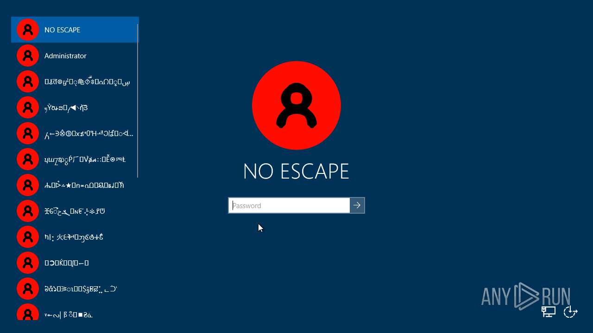

# Malware Analysis Report — NoEscape.exe

## 1. Executive Summary

This report documents the static analysis of `NoEscape.exe`, a Windows executable associated with the **NoEscape** malware/sample by Endermach.

The initial analysis identified the specimen as a **32-bit Windows PE executable** with a strong indication that it has been **packed using MPRESS**. The presence of `.MPRESS1` and `.MPRESS2` sections significantly affects conventional static analysis because strings, imports, and code may be compressed or transformed until the executable is unpacked.

The analysis therefore focuses on:

* PE identification
* File architecture and metadata
* Section analysis
* Detection of packing
* Initial static-analysis observations
* Implications of MPRESS packing
* Recommended unpacking and dynamic-analysis workflow
* Correlation between static and dynamic behavior

At this stage, the presence of MPRESS packing is one of the most important findings because it explains why straightforward inspection of the executable provides limited visibility into its actual functionality.

---

## 2. Specimen Identification

| Property           | Value                                                              |
| ------------------ | ------------------------------------------------------------------ |
| Filename           | `NoEscape.exe`                                                     |
| File size          | 682,655 bytes                                                      |
| SHA-256            | `d30d7676a3b4c91b77d403f81748ebf6b8824749db5f860e114a8a204bca5b8f` |
| File format        | Windows PE                                                         |
| PE type            | PE32                                                               |
| Architecture       | Intel 386 / x86                                                    |
| Bitness            | 32-bit                                                             |
| Number of sections | 3                                                                  |
| Suspected packer   | MPRESS                                                             |
| Sample             | NoEscape by Endermach                                              |

### SHA-256

The SHA-256 hash should be used to uniquely identify this exact specimen during the investigation:

```text
d30d7676a3b4c91b77d403f81748ebf6b8824749db5f860e114a8a204bca5b8f
```

---

# 3. Initial PE Analysis

The executable was identified as a **PE32 executable for the Intel 386/x86 architecture**.

An `objdump` inspection produced:

```text
NoEscape.exe: file format coff-i386
architecture: i386
```

This establishes that the binary is a **32-bit Windows executable**, rather than an x86-64 executable.

The executable therefore needs to be analyzed with the appropriate 32-bit Windows assumptions when examining:

* Registers
* Calling conventions
* Stack layout
* Windows API calls
* Disassembly
* PE structures

---

# 4. PE Sections

The executable contains three sections:

```text
.MPRESS1
.MPRESS2
.rsrc
```

The two sections beginning with `.MPRESS` are a major indicator that the executable has been processed using **MPRESS**.

## `.MPRESS1`

This is an MPRESS-related section containing packed/compressed executable data.

Because the original program code can be compressed or transformed by the packer, direct disassembly of this section may not resemble the original program's logic.

## `.MPRESS2`

The second MPRESS section is another strong indicator of the packer's presence.

Together, `.MPRESS1` and `.MPRESS2` strongly suggest that the executable is **MPRESS-packed**.

## `.rsrc`

The `.rsrc` section is the Windows resource section.

It may contain resources such as:

* Icons
* Version information
* Dialogs
* Embedded data
* Manifest information
* Other Windows resources

The resource section should therefore be inspected independently because resources can sometimes provide useful information even when the executable's main code is packed.

---

# 5. MPRESS Packing

## What is MPRESS?

MPRESS is a Windows executable packer.

A packer transforms an executable so that its original code and/or data are stored in a compressed or transformed form. A small unpacking stub executes first and reconstructs the original program in memory.

Conceptually:

```text
Original executable
        |
        v
     MPRESS
        |
        v
Packed executable
        |
        v
MPRESS unpacking stub
        |
        v
Original code reconstructed in memory
        |
        v
Program execution
```

This is important for malware analysis because the code visible on disk may not be the code that actually performs the interesting behavior.

---

# 6. Why Packing Matters

Packing can interfere with several traditional static-analysis techniques.

### Strings

Running:

```bash
strings NoEscape.exe
```

may produce relatively little useful information compared with an unpacked executable.

Potentially useful strings may be:

* compressed
* encoded
* stored in packed sections
* generated dynamically at runtime

Therefore, a lack of obvious strings should **not** be interpreted as proof that the program does not contain those strings.

### Imports

Similarly, the import table may be smaller or less informative than expected.

A packed executable may initially import only functions required by the unpacking stub.

The malware's actual APIs may be resolved later during execution.

### Disassembly

Opening the packed executable directly in a disassembler such as Ghidra can produce:

* confusing control flow
* apparently meaningless instructions
* incorrect function boundaries
* packed/decompression routines
* limited high-level understanding

The most useful code may only become visible after the executable has unpacked itself in memory.

---

# 7. Static Analysis Findings

The initial static analysis produced the following important observations.

### Finding 1 — Windows PE32 executable

The specimen is a 32-bit Windows executable:

```text
PE32
Intel 386 / x86
```

This establishes the target platform and architecture.

### Finding 2 — MPRESS sections

The executable contains:

```text
.MPRESS1
.MPRESS2
```

This is a strong indication of MPRESS packing.

### Finding 3 — Limited visibility into original code

Because the actual code is packed, analysis of:

* strings
* imports
* functions
* control flow

may not reveal the full functionality of the original executable.

---

# 9. Dynamic Analysis

## 9.1 Objective

Dynamic analysis was performed using publicly available sandbox executions of the exact `NoEscape.exe` specimen identified during static analysis.

The specimen was identified by the following SHA-256:

```text
D30D7676A3B4C91B77D403F81748EBF6B8824749DB5F860E114A8A204BCA5B8F
```

Because the original analysis environment did not include a dedicated Windows malware-analysis VM, public sandbox executions of the same hash were used as behavioral evidence.

The primary sandbox used for behavioral analysis was ANY.RUN. A separate Hybrid Analysis/Falcon Sandbox execution was also examined for corroborating evidence.

---

# 9.2 ANY.RUN Analysis

ANY.RUN is an interactive malware sandbox that executes samples inside an isolated Windows environment while monitoring system behavior.

The exact SHA-256 was executed in a Windows 10 Professional 64-bit environment.

One documented execution used:

```text
Operating System: Windows 10 Professional
Build: 19044
Architecture: 64-bit

Sample:
NoEscape.exe

Sample architecture:
PE32 / Intel 80386

Task duration:
300 seconds

Additional time:
240 seconds

Network:
Enabled

MITM proxy:
Disabled

FakeNet:
Disabled

Tor:
Disabled

Heavy Evasion:
Disabled

UAC auto-confirmation:
Enabled
```

The sandbox exposes runtime information including:

* Process activity
* Registry activity
* File activity
* Debug/system events
* Network activity
* Screenshots
* Behavioral signatures
* MITRE ATT&CK mappings

---

# 9.3 Processes Observed

The sandbox observed the primary malicious process:

```text
NoEscape.exe
```

and additional executions of:

```text
winnt32.exe
```

The presence of `winnt32.exe` is significant because other behavioral evidence connects this executable to persistence through the Windows Winlogon configuration.

The observed process chain can be summarized as:

```text
NoEscape.exe
     |
     +----> creates/modifies executable content
     |
     +----> modifies registry
     |
     +----> modifies Windows security settings
     |
     v
winnt32.exe
```

---

# 9.4 Registry Activity

One of the most significant dynamic findings was modification of Windows registry configuration.

The sandbox detected:

```text
Changes the login/logoff helper path in the registry
```

This behavior is associated with the Windows Winlogon mechanism.

The observed persistence configuration is:

```text
HKLM\SOFTWARE\Microsoft\Windows NT\CurrentVersion\Winlogon

Userinit =
C:\Windows\system32\userinit.exe,
C:\Windows\winnt32.exe
```

This causes `winnt32.exe` to be executed as part of the Windows logon initialization process.

The behavior therefore represents a persistence mechanism:

```text
NoEscape.exe
      |
      v
Creates/uses winnt32.exe
      |
      v
Modifies Winlogon\Userinit
      |
      v
User logs into Windows
      |
      v
winnt32.exe executes
```

---

# 9.5 UAC/LUA Modification

ANY.RUN detected:

```text
UAC/LUA settings modification
```

The relevant configuration is associated with:

```text
HKLM\SOFTWARE\Microsoft\Windows\CurrentVersion\Policies\System
```

including modification of the `EnableLUA` setting.

The purpose of this modification is to weaken Windows User Account Control.

This is important because the malware is not only attempting to execute persistently but is also modifying a Windows security mechanism.

---

# 9.6 Shutdown Modification

The sandbox detected:

```text
Disables the Shutdown in the Start menu
```

This behavior interferes with normal system shutdown controls.

It is consistent with the broader behavior of NoEscape modifying the Windows environment rather than simply performing conventional information theft.

---

# 9.7 Executable File Modification

ANY.RUN detected:

```text
Executable content was dropped or overwritten
```

and the execution of:

```text
winnt32.exe
```

was observed.

The dropped executable is significant because it is subsequently associated with the Winlogon persistence mechanism.

---

# 9.8 System Discovery

The sandbox recorded several system-discovery behaviors.

NoEscape was observed:

```text
Reading the computer name
Checking supported languages
Checking computer location settings
Reading Internet Explorer security settings
```

These observations indicate that the program gathers information about the environment in which it is executing.

The language and location checks may also be useful to malware for environment identification or conditional behavior.

---

# 9.9 Hybrid Analysis / Falcon Sandbox

A separate execution of the exact same SHA-256 was analyzed by Hybrid Analysis, powered by Falcon Sandbox.

Environment:

```text
Operating System: Windows 10 64-bit Professional
Build: 16299
```

The process analyzed was:

```text
NoEscape.exe
PID: 4200
```

Falcon Sandbox generated a process-memory dump of approximately:

```text
1.8 MiB
```

This memory dump was subsequently analyzed for:

* API references
* Loaded modules
* Strings
* Runtime artifacts
* Behavioral indicators

---

# 9.10 Runtime API Evidence

The memory analysis identified references to APIs including:

```text
ShellExecuteW
ShowWindow
GetModuleHandleA
FreeSid
CoTaskMemFree
BCryptGenRandom
GetDC
GetDCEx
GetWindowDC
CreateDCA
CreateDCW
CreateCompatibleBitmap
CreateCompatibleDC
BitBlt
```

These API references provide additional evidence about functionality present in the executing process.

In particular, the presence of graphical APIs such as:

```text
GetDC
GetWindowDC
CreateCompatibleBitmap
BitBlt
```

is consistent with functionality capable of interacting with or capturing graphical content.

However, API presence alone should not be interpreted as proof that a particular action occurred during the execution.

---

# 9.11 Loaded Modules

The memory analysis also identified Windows modules loaded by the process, including:

```text
KERNEL32.DLL
OLE32.DLL
OLEAUT32.DLL
RPCRT4.DLL
SSPICLI.DLL
UXTHEME.DLL
MSCTF.DLL
BCRYPTPRIMITIVES.DLL
```

and other Windows API-set modules.

This provides runtime evidence of the libraries actually available to the process.

---

# 9.12 Network Activity

The Hybrid Analysis execution reported:

```text
Relevant DNS requests: None
Relevant contacted hosts: None
Relevant HTTP requests: None
```

Therefore, meaningful command-and-control communication was not established from this execution.

Other sandbox executions contained normal Windows certificate/revocation traffic. Such traffic should not automatically be classified as malware C2.

The available evidence therefore does not support describing NoEscape as a network-dependent C2 malware sample.

---

# 9.13 Memory Analysis and MPRESS

Static analysis identified:

```text
.MPRESS1
.MPRESS2
```

which strongly indicated MPRESS packing.

The Hybrid Analysis execution subsequently captured the process in memory and identified runtime APIs, modules, and strings.

This produces an important static/dynamic correlation:

```text
                STATIC ANALYSIS
                       |
                       v
             .MPRESS1 / .MPRESS2
                       |
                       v
                MPRESS packing
                       |
                       v
          Original functionality obscured
                       |
                       v
                DYNAMIC EXECUTION
                       |
                       v
              Process memory dump
                       |
                       v
           Runtime APIs / modules / strings
                       |
                       v
           Additional functionality exposed
```

This demonstrates why packed executables should not be analyzed exclusively from their on-disk representation.

---

# 9.14 Static vs Dynamic Correlation

| Static Observation            | Dynamic Observation                                                       | Assessment      |
| ----------------------------- | ------------------------------------------------------------------------- | --------------- |
| PE32 executable               | Executed as a 32-bit Windows process                                      | Consistent      |
| Intel 386 architecture        | Executed successfully under 64-bit Windows through WOW64                  | Consistent      |
| `.MPRESS1` section            | Runtime process generated memory artifacts                                | Consistent      |
| `.MPRESS2` section            | Runtime APIs/modules became observable                                    | Consistent      |
| Packed executable             | Sandbox behavior exposed functionality not obvious from static inspection | Consistent      |
| Potential persistence         | Winlogon helper path modified                                             | Confirmed       |
| Potential system modification | UAC/LUA settings modified                                                 | Confirmed       |
| Potential system interference | Shutdown option disabled                                                  | Confirmed       |
| Potential payload deployment  | Executable content dropped/overwritten                                    | Confirmed       |
| Runtime secondary executable  | `winnt32.exe` observed                                                    | Confirmed       |
| Environment awareness         | Computer name/language/location queried                                   | Confirmed       |
| Network capability            | No relevant network traffic in Falcon Sandbox                             | Not established |

---

# 9.15 Evidence Classification

The findings should be divided into three categories.

## Confirmed by dynamic execution

```text
Winlogon helper modification
UAC/LUA modification
Shutdown-menu modification
Executable content dropped/overwritten
winnt32.exe execution
Computer-name discovery
Language discovery
Location/environment checks
```

## Corroborated by runtime memory analysis

```text
ShellExecuteW
ShowWindow
GetModuleHandleA
Graphical/GDI APIs
Windows DLL/module loading
Runtime strings
```

## Not established from the available evidence

```text
Definitive C2 communication
Definitive exfiltration
Definitive credential theft by NoEscape itself
```

A sandbox detection involving another process should not automatically be attributed to NoEscape.

---

# 9.16 Overall Behavioral Assessment

The dynamic evidence is strongly consistent with the static analysis.

Static analysis initially showed a small number of unusual sections:

```text
.MPRESS1
.MPRESS2
```

indicating that the executable was packed.

Dynamic analysis demonstrated that once the executable was running, it performed significant Windows system modifications.

The most important behavioral chain is:

```text
                NoEscape.exe
                     |
       +-------------+-------------+
       |             |             |
       v             v             v
    Registry       Files        System
    changes       changes     modifications
       |             |             |
       v             v             v
   Winlogon      winnt32.exe    UAC/LUA
   persistence                  Shutdown
       |                         settings
       +-------------+-----------+
                     |
                     v
              Persistent system
                 modification
```

The static and dynamic evidence therefore reinforce one another.

The static analysis explains **why the executable was difficult to inspect**, while the dynamic analysis demonstrates **what the running program actually does**.

---

# 9.17 Limitations

The analysis was performed using public sandbox executions rather than a personally controlled malware-analysis VM.

Therefore:

1. The exact sandbox configuration cannot be assumed to represent every possible execution environment.
2. Sandbox signatures can sometimes attribute activity to the wrong process.
3. API presence does not necessarily prove that the corresponding functionality was exercised.
4. Behavior observed in one sandbox run may not occur in another run.
5. Network traffic generated by the operating system should not automatically be classified as malware C2.
6. Findings from other NoEscape variants should not be presented as observations of this exact SHA-256 without separate evidence.

The highest-confidence findings are those directly attributed to `NoEscape.exe` in multiple sandbox executions.

---

# 9.18 Conclusion

Dynamic analysis substantially strengthened the conclusions obtained from static analysis.

The sample was confirmed to execute as a PE32 Windows executable and was repeatedly identified by public sandbox environments as malicious.

The most significant observed behaviors were:

* Winlogon persistence
* UAC/LUA modification
* Shutdown-control modification
* Executable file modification
* Creation/execution of `winnt32.exe`
* System/environment discovery

The separate Falcon Sandbox memory analysis also demonstrated that useful runtime APIs, modules, and strings could be recovered from the executing process.

This is particularly relevant to the original MPRESS finding:

```text
Packed executable on disk
          ↓
Limited static visibility
          ↓
Runtime execution
          ↓
Memory acquisition
          ↓
Runtime artifacts
          ↓
Behavioral analysis
```

Therefore, the investigation demonstrates the complementary nature of static and dynamic malware analysis.

---

# 9.19 Primary Sources

* ANY.RUN — exact SHA-256 behavioral analysis:
  `https://any.run/report/d30d7676a3b4c91b77d403f81748ebf6b8824749db5f860e114a8a204bca5b8f/c91333a0-fd55-4c00-b1f0-48e02f9c20cb`

* ANY.RUN — additional exact-hash execution:
  `https://any.run/report/d30d7676a3b4c91b77d403f81748ebf6b8824749db5f860e114a8a204bca5b8f/d0b4f9f0-a629-4838-ac4b-8822b57cb672`

* Hybrid Analysis / Falcon Sandbox — exact SHA-256:
  `https://hybrid-analysis.com/sample/d30d7676a3b4c91b77d403f81748ebf6b8824749db5f860e114a8a204bca5b8f/65c4e3528263c2163f0c8480`

---

# 9.20 Key Takeaway

> **Static analysis told us that NoEscape was packed. Dynamic analysis showed us what the packed program actually did once executed.**

The strongest correlation is therefore:

```text
STATIC:
PE32 + .MPRESS1 + .MPRESS2
              ↓
        Packed executable
              ↓
DYNAMIC:
Registry + filesystem + process + system modifications
              ↓
     Observable malicious behavior
```
