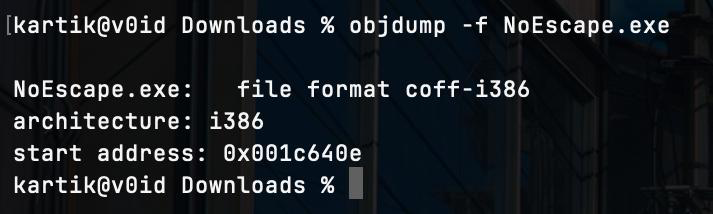
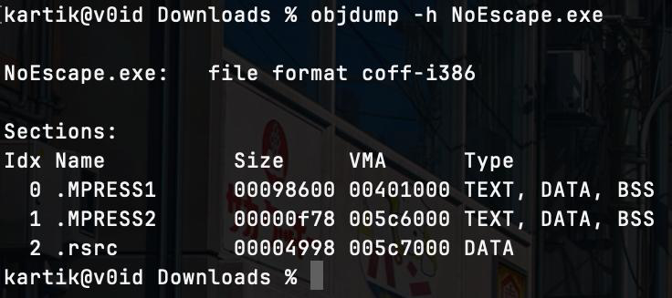

# Malware Analysis Report — NoEscape.exe

## 1. Summary

This report documents the static analysis of `NoEscape.exe`, a Windows executable associated with the **NoEscape** malware/sample by Endermach.

The initial analysis identified the specimen as a **32-bit Windows PE executable** with a strong indication that it has been **packed using MPRESS**. The presence of `.MPRESS1` and `.MPRESS2` sections significantly affects conventional static analysis because strings, imports, and code may be compressed or transformed until the executable is unpacked.

The analysis therefore focuses on:

* PE identification
* File architecture and metadata
* Section analysis
* Detection of packing
* Initial static-analysis observations
* Implications of MPRESS packing
* Recommended unpacking and dynamic-analysis workflow
* Correlation between static and dynamic behavior

At this stage, the presence of MPRESS packing is one of the most important findings because it explains why straightforward inspection of the executable provides limited visibility into its actual functionality.

---

## 2. Specimen Identification

| Property           | Value                                                              |
| ------------------ | ------------------------------------------------------------------ |
| Filename           | `NoEscape.exe`                                                     |
| File size          | 682,655 bytes                                                      |
| SHA-256            | `d30d7676a3b4c91b77d403f81748ebf6b8824749db5f860e114a8a204bca5b8f` |
| File format        | Windows PE                                                         |
| PE type            | PE32                                                               |
| Architecture       | Intel 386 / x86                                                    |
| Bitness            | 32-bit                                                             |
| Number of sections | 3                                                                  |
| Suspected packer   | MPRESS                                                             |
| Sample             | NoEscape by Endermach                                              |

### SHA-256

The SHA-256 hash should be used to uniquely identify this exact specimen during the investigation:

```text
d30d7676a3b4c91b77d403f81748ebf6b8824749db5f860e114a8a204bca5b8f
```


---

# 3. Initial PE Analysis

The executable was identified as a **PE32 executable for the Intel 386/x86 architecture**.

An `objdump` inspection produced:

```text
NoEscape.exe: file format coff-i386
architecture: i386
```

This establishes that the binary is a **32-bit Windows executable**, rather than an x86-64 executable.

The executable therefore needs to be analyzed with the appropriate 32-bit Windows assumptions when examining:

* Registers
* Calling conventions
* Stack layout
* Windows API calls
* Disassembly
* PE structures



---

# 4. PE Sections

The executable contains three sections:

```text
.MPRESS1
.MPRESS2
.rsrc
```

The two sections beginning with `.MPRESS` are a major indicator that the executable has been processed using **MPRESS**.

## `.MPRESS1`

This is an MPRESS-related section containing packed/compressed executable data.

Because the original program code can be compressed or transformed by the packer, direct disassembly of this section may not resemble the original program's logic.

## `.MPRESS2`

The second MPRESS section is another strong indicator of the packer's presence.

Together, `.MPRESS1` and `.MPRESS2` strongly suggest that the executable is **MPRESS-packed**.

## `.rsrc`

The `.rsrc` section is the Windows resource section.

It may contain resources such as:

* Icons
* Version information
* Dialogs
* Embedded data
* Manifest information
* Other Windows resources

The resource section should therefore be inspected independently because resources can sometimes provide useful information even when the executable's main code is packed.



---

# 5. MPRESS Packing

## What is MPRESS?

MPRESS is a Windows executable packer.

A packer transforms an executable so that its original code and/or data are stored in a compressed or transformed form. A small unpacking stub executes first and reconstructs the original program in memory.

Conceptually:

```text
Original executable
        |
        v
     MPRESS
        |
        v
Packed executable
        |
        v
MPRESS unpacking stub
        |
        v
Original code reconstructed in memory
        |
        v
Program execution
```

This is important for malware analysis because the code visible on disk may not be the code that actually performs the interesting behavior.

---

# 6. Why Packing Matters

Packing can interfere with several traditional static-analysis techniques.

### Strings

Running:

```bash
strings NoEscape.exe
```

may produce relatively little useful information compared with an unpacked executable.

Potentially useful strings may be:

* compressed
* encoded
* stored in packed sections
* generated dynamically at runtime

Therefore, a lack of obvious strings should **not** be interpreted as proof that the program does not contain those strings.

### Imports

Similarly, the import table may be smaller or less informative than expected.

A packed executable may initially import only functions required by the unpacking stub.

The malware's actual APIs may be resolved later during execution.

### Disassembly

Opening the packed executable directly in a disassembler such as Ghidra can produce:

* confusing control flow
* apparently meaningless instructions
* incorrect function boundaries
* packed/decompression routines
* limited high-level understanding

The most useful code may only become visible after the executable has unpacked itself in memory.

---

# 7. Static Analysis Findings

The initial static analysis produced the following important observations.

### Finding 1 — Windows PE32 executable

The specimen is a 32-bit Windows executable:

```text
PE32
Intel 386 / x86
```

This establishes the target platform and architecture.

### Finding 2 — MPRESS sections

The executable contains:

```text
.MPRESS1
.MPRESS2
```

This is a strong indication of MPRESS packing.

### Finding 3 — Limited visibility into original code

Because the actual code is packed, analysis of:

* strings
* imports
* functions
* control flow

may not reveal the full functionality of the original executable.


---

# Dynamic Analysis of NoEscape.exe

## What Are We Trying to Find?

Static analysis tells us what a malware file **contains**.

Dynamic analysis tells us what the malware **actually does when it runs**.

For example:

```text
Static Analysis:
"What is inside NoEscape.exe?"

Dynamic Analysis:
"What happens when we execute NoEscape.exe?"
```

Because NoEscape is packed with MPRESS, dynamic analysis is especially useful.

---

# 1. How Was the Malware Tested?

We did not execute the malware on a normal personal computer.

Instead, we used publicly available malware-analysis sandboxes that had already executed the **same exact file**.

The sample was identified using its SHA-256 hash:

```text
D30D7676A3B4C91B77D403F81748EBF6B8824749DB5F860E114A8A204BCA5B8F
```

The two main sources used were:

* ANY.RUN
* Hybrid Analysis / Falcon Sandbox

These services run suspicious files inside isolated Windows environments and watch what happens.

---

# 2. What Is a Malware Sandbox?

Imagine a laboratory room.

A scientist can put a dangerous substance inside the room, perform an experiment, and observe what happens without exposing the rest of the building.

A malware sandbox works in a similar way:

```text
Suspicious file
      ↓
Isolated Windows environment
      ↓
Run the file
      ↓
Watch what it does
      ↓
Generate a report
```

The sandbox can monitor things such as:

* Programs that start
* Files that are created or modified
* Registry changes
* Network connections
* System settings
* Other suspicious activity

For our investigation, ANY.RUN and Hybrid Analysis provided this type of evidence.

---

# 3. What Happened When NoEscape Ran?

The most important finding is that NoEscape does not simply run and exit.

It begins changing the Windows environment.

The sandbox observed activity involving:

```text
NoEscape.exe
      |
      ├── Registry changes
      |
      ├── Windows security changes
      |
      ├── File changes
      |
      └── winnt32.exe
```

These changes are important because they can allow the malware to remain active and interfere with the normal operation of Windows.

---

# 4. NoEscape Creates/Uses winnt32.exe

One of the most important observations was:

```text
C:\Windows\winnt32.exe
```

The malware creates/uses this executable as part of its behavior.

The interesting part is what happens next.

NoEscape modifies a Windows login-related setting so that `winnt32.exe` can be executed when a user logs into Windows.

---

# 5. Persistence Through Winlogon

## What does persistence mean?

Persistence simply means:

> "How does malware make sure it can come back after the computer restarts?"

For example:

```text
Malware runs
     ↓
Creates persistence
     ↓
Computer restarts
     ↓
User logs in
     ↓
Malware runs again
```

NoEscape uses a Windows login mechanism for this.

The sandbox observed a modification to:

```text
HKLM\SOFTWARE\Microsoft\Windows NT\CurrentVersion\Winlogon
```

Specifically, the `Userinit` configuration was modified to include:

```text
C:\Windows\system32\userinit.exe,
C:\Windows\winnt32.exe
```

In simple terms:

> NoEscape tells Windows to also run `winnt32.exe` when the user logs in.

This is one of the strongest findings in the dynamic analysis.

---

# 6. NoEscape Modifies UAC

## What is UAC?

UAC stands for **User Account Control**.

It is the security feature that can show a Windows permission prompt when a program wants to perform an important action.

A simplified example:

```text
Program wants to change system settings
              ↓
        Windows checks
              ↓
          UAC prompt
              ↓
       User approves
```

The sandbox observed NoEscape modifying the Windows UAC/LUA configuration.

This is significant because malware is modifying a security mechanism that normally helps protect the system.

---

# 7. NoEscape Disables Registry Tools

The sandbox also observed a modification associated with:

```text
HKCU\SOFTWARE\Microsoft\Windows\CurrentVersion\Policies\System
```

including:

```text
DisableRegistryTools = 1
```

The effect is to disable normal access to Windows Registry Editor.

Why would malware do this?

Because the Registry is where some of its own modifications exist.

Conceptually:

```text
NoEscape
   ↓
Changes Registry
   ↓
Disables Registry Editor
   ↓
Makes manual cleanup more difficult
```

This is an example of malware interfering with the tools a user might use to fix the system.

---

# 8. NoEscape Changes Windows Behavior

The sandbox observed several other system modifications.

### Shutdown

NoEscape disables the normal Shutdown option in the Start menu.

### Mouse

It modifies:

```text
SwapMouseButtons
```

which can swap the primary and secondary mouse buttons.

### Keyboard

It modifies the Windows keyboard:

```text
Scancode Map
```

which can change how keyboard keys are interpreted.

These behaviors demonstrate that NoEscape is not simply trying to hide itself.

It actively changes the user's Windows environment.

---

# 9. System Information Gathering

Before or during its execution, NoEscape also checks information about the computer.

Observed activity includes checking:

* Computer name
* Supported languages
* Location/environment settings
* Windows security-related settings

Why might malware do this?

A program can use information about its environment to decide what to do next.

For example:

```text
Start
 ↓
Check computer
 ↓
Check environment
 ↓
Decide what behavior to perform
```

We should not automatically assume that every piece of information collected is being sent to an attacker.

---

# 10. What Did the Second Sandbox Find?

The exact same SHA-256 was also analyzed using Hybrid Analysis / Falcon Sandbox.

This gave us an additional piece of evidence.

The sandbox captured the running process in memory.

The memory analysis found references to Windows APIs such as:

```text
ShellExecuteW
ShowWindow
GetModuleHandleA
GetDC
GetWindowDC
CreateCompatibleBitmap
BitBlt
CreateCompatibleDC
BCryptGenRandom
```

These are Windows functions that programs can use for things such as:

* Launching programs
* Controlling windows
* Working with graphical data
* Generating random data
* Accessing Windows functionality

Important:

> Finding an API does not automatically prove that the malware performed the corresponding action.

It simply tells us that the functionality is present or available to the program.

---

# 11. What About Network Activity?

This is an important negative finding.

The available Falcon Sandbox execution did **not** establish meaningful command-and-control communication from NoEscape.

In other words:

```text
No strong evidence of:

NoEscape → Attacker server
```

was found in that execution.

Some sandbox traffic can come from normal Windows components, so simply seeing network traffic does not mean that malware C2 occurred.

Therefore:

> Network-based command-and-control was not established from the available evidence.

---

# 12. How Does This Connect to Our Static Analysis?

This is where the two parts of the investigation come together.

Our static analysis found:

```text
PE32
   ↓
.MPRESS1
.MPRESS2
   ↓
MPRESS-packed executable
```

Packing makes it harder to understand the original program by simply looking at the file.

Then dynamic analysis showed:

```text
Run NoEscape
      ↓
Observe runtime behavior
      ↓
Registry changes
      ↓
File changes
      ↓
Winlogon modification
      ↓
UAC modification
      ↓
winnt32.exe
```

So the two analyses complement each other.

---

# 13. Static vs Dynamic

| Static Analysis                      | Dynamic Analysis                           |
| ------------------------------------ | ------------------------------------------ |
| Looks at the file without running it | Runs the file in a controlled environment  |
| Found PE32/x86                       | Confirmed it executes as a Windows process |
| Found `.MPRESS1`                     | Runtime behavior became observable         |
| Found `.MPRESS2`                     | Process memory could be inspected          |
| Examines strings/imports/code        | Watches actual system changes              |
| Tells us what may be inside          | Tells us what the program actually does    |

A simple way to remember it:

```text
STATIC
"What is this file?"

        +

DYNAMIC
"What does this file do?"

        =

Better malware analysis
```

---

# 14. Most Important Findings

The strongest dynamic findings for NoEscape are:

### 1. Persistence

NoEscape modifies the Winlogon `Userinit` configuration.

```text
Winlogon
   ↓
Userinit
   ↓
winnt32.exe
```

### 2. Security modification

It modifies UAC/LUA-related settings.

### 3. System interference

It changes Windows behavior, including:

* Shutdown controls
* Mouse configuration
* Keyboard configuration

### 4. File modification

It creates/uses:

```text
C:\Windows\winnt32.exe
```

### 5. Environment discovery

It checks information about the computer and its configuration.

### 6. Runtime evidence

A separate sandbox captured process memory containing Windows API references and runtime artifacts.

---

# 15. What We Can Confidently Say

Based on the available sandbox evidence:

> NoEscape is a malicious Windows executable that modifies the Windows environment, establishes persistence through a login-related mechanism, changes security-related settings, and creates/uses an additional executable named `winnt32.exe`.

The behavior is consistent with our static analysis because the executable was identified as an MPRESS-packed PE32 binary, meaning that important functionality may not be obvious from the original file alone.

---

# 16. What We Should NOT Claim

Malware analysis requires distinguishing evidence from assumptions.

We should **not** claim that:

* Every API found in memory was necessarily executed.
* Every network connection in the sandbox was C2.
* NoEscape definitely stole passwords based only on a generic sandbox detection.
* Every behavior from another NoEscape variant occurred in this exact sample.
* Packing automatically means the file is malicious.

The strongest conclusions are the behaviors directly observed and attributed to the exact SHA-256.

---

# 17. Final Analysis Chain

The complete investigation can be summarized as:

```text
                 NoEscape.exe
                       |
                       v
                STATIC ANALYSIS
                       |
                       v
             PE32 / x86 executable
                       |
                       v
                .MPRESS1 / .MPRESS2
                       |
                       v
                  MPRESS packed
                       |
                       v
              DYNAMIC ANALYSIS
                       |
                       v
               Execute in sandbox
                       |
          +------------+------------+
          |            |            |
          v            v            v
      Registry       Files       Processes
       changes      changes       changes
          |            |            |
          v            v            v
      Winlogon     winnt32.exe   Runtime
      persistence                behavior
          |
          v
       UAC/system
       modification
          |
          v
       Final behavioral
         assessment
```

---

# 18. Key Takeaway

The most important lesson from NoEscape is:

> **A malware analyst should not rely on a single type of analysis.**

Static analysis helped us understand the structure of the file and identify MPRESS packing.

Dynamic analysis then showed what happened when the program actually ran.

Together:

```text
Static analysis
      +
Dynamic analysis
      ↓
Much clearer understanding of the malware
```

That is the fundamental workflow we used to investigate NoEscape.exe.
